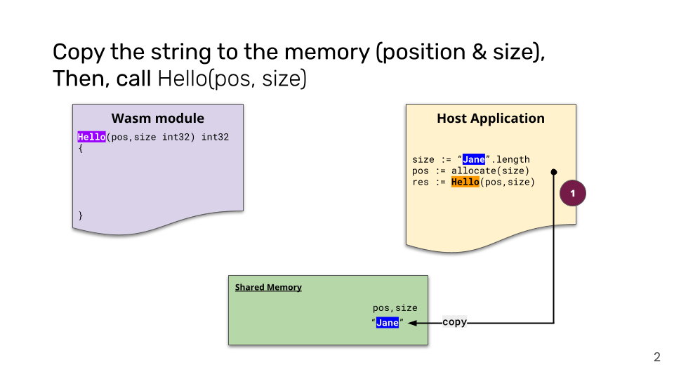

# Hello

👋 Philippe Charrière
🆇 @k33g_org
🐳 Sr Solution Architext @ Docker

> Disclaimer: I am not an engineer and I am learning on the job
---

# Introduction

## WebAssembly (Wasm), 🐣 baby steps (in the browser 🌍)

---

# Wasm?

- Code > Bytecode (wasm binary file)
- Binary format for executing code on the Web
- The JavaScript VM is responsible for the execution of the WASM code
- WASM is polyglot
- WASM is safe

---

# Why WASM?

- A complement to JavaScript
- Near-native speeds
- Complex applications in web browsers

---

# The primary qualities of WASM

- Speed, 
- Efficiency, 
- Safe, 
- Versatile, 
- Portable

---

# WebAssembly in the browser is amazing

- https://earth.google.com/
- https://stackblitz.com/edit/node-5xrecy?file=index.js

---

# Simplest Demo

## C in the browser 🤔

- 00-wasm-c

---

# Wasi

> https://wasi.dev

- Wasi: WebAssembly System Interface
- Interface between 
  - WebAssembly (WASM) code  
  - and a Runtime environment
- Allowing WASM code to be run in various contexts (even the browser) 

> We'll speak about this later
---

# Demo

## Go in the browser

- 01-wasm-go

--- 

# Some Limitations

- Only numbers 😮
- How to pass string arguments to a Wasm function?
- How to return a string as the result of a Wasm function call?

---

# Workaround

## Solution: Shared Memory Buffer

---

---

---

---

---

# Demo "Plumbing"

## Go in the browser & hack

- 02-wasm-go -> *Hello Bob Morane* 🤬

---

# 📗 To read

- About WASM, WASI and Strings with NodeJS: https://k33g.hashnode.dev/series/wasi-nodejs
