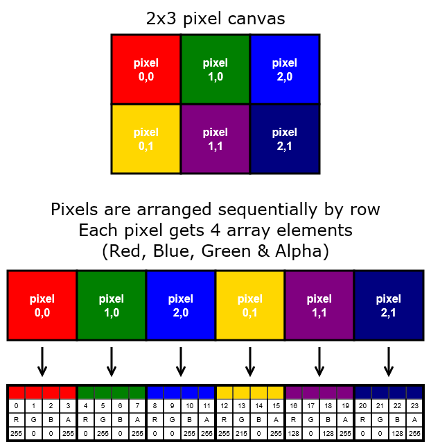
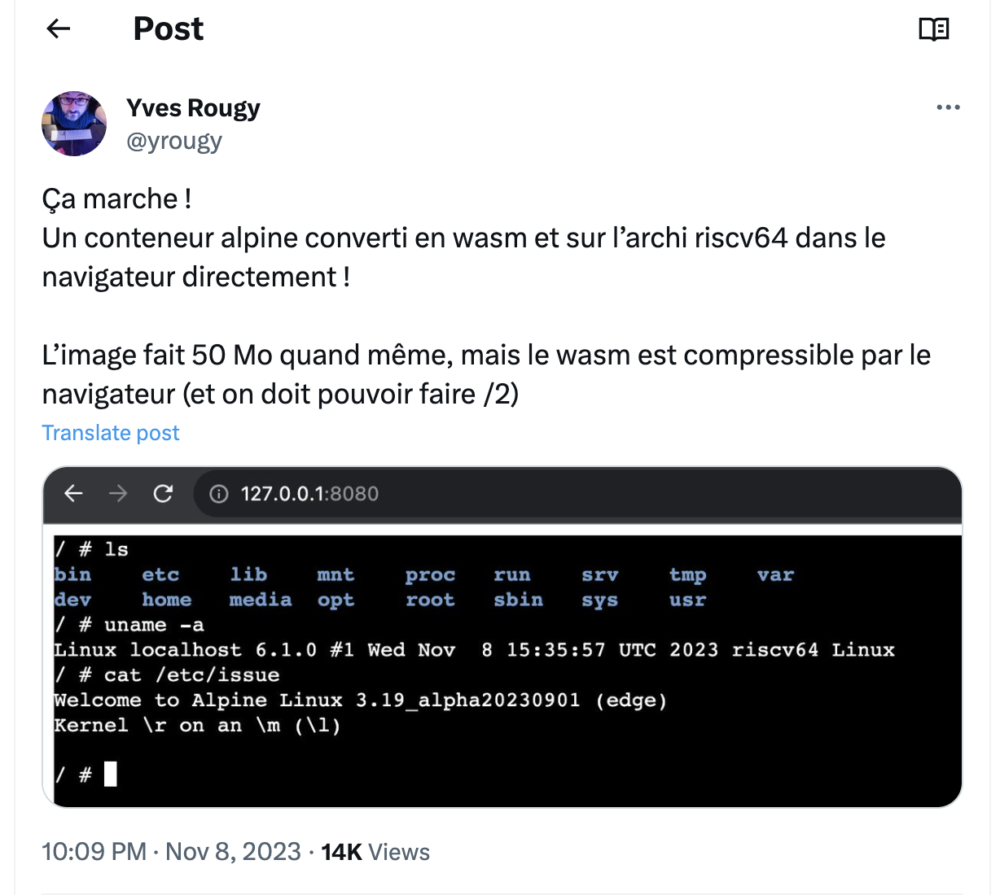

# WASM Part 3

## WebAssembly (Wasm), GoLang, TinyGo and JavaScript

---
# Agenda

## WASM Go + JavaScript
- Document Object Model
- return JSON
- JSON as argument
- Call a JavaScript function
- Call a Promise

## References
- Reading and Writing Graphics
- Reading and Writing Audio

---
# Document Object Model
## Go (WASM) uses the DOM
```golang
message := "👋 Hello World from TinyGo 🌍"

// 1- reference to the DOM
document := js.Global().Get("document")

// 2- create H2 element
h2 := document.Call("createElement", "h2")
h2.Set("innerHTML", message)
```

---
# Return JSON
## Go (WASM) function returns JSON to JS
```golang
return map[string]interface{} {
  "message": "Hello " + firstName + " " + lastName,
  "greetings":  "👋 Hey 🎉",
}
```

---
# JSON as argument
## Go (WASM) function uses JSON as argument

```golang
func Hello(this js.Value, args []js.Value) interface{} {

	// get the first parameter
	human := args[0]

	// get members of human
	firstName := human.Get("firstName").String()
	lastName := human.Get("lastName").String()

}
```

---
# Call a JS function from WASM
## And read a JS variable

```golang
value := js.Global().Call("sayHello", "Bill")
message := js.Global().Get("message").String()
```

---
# Call a promise

```golang
// 1- if everything goes well
thenFunc := func(this js.Value, args []js.Value) interface{} {
  fmt.Println("🎉 All good:", args[0].String())
  return ""
}

// 2- catch the error
catchFunc := func(this js.Value, args []js.Value) interface{} {
  fmt.Println("😡 Ouch:", args[0].Get("message"))
  return ""
}

// 3- call the promise
js.Global().Call("compute", false).Call("then", js.FuncOf(thenFunc)).Call("catch", js.FuncOf(catchFunc))
    
```
---

## Some refs if you want to go further

---
<!--
# Reading and Writing Graphics


> https://riptutorial.com/html5-canvas/example/19790/introduction-to--context-getimagedata-
---
-->
# Reading and Writing Graphics

- [Reading and Writing Graphics (with wasm)](https://wasmbyexample.dev/examples/reading-and-writing-graphics/reading-and-writing-graphics.go.en-us.html)
- HTML/JavaScript:
  - [API/ImageData](https://developer.mozilla.org/en-US/docs/Web/API/ImageData)
  - [Pixel manipulation with canvas](https://developer.mozilla.org/en-US/docs/Web/API/Canvas_API/Tutorial/Pixel_manipulation_with_canvas)
  - [Example: Canvas ImageData data Property](https://www.w3schools.com/jsref/canvas_imagedata_data.asp)
  - [Example: HTML5 Canvas Image Data](http://www.java2s.com/Tutorials/HTML_CSS/HTML5_Canvas/0620__HTML5_Canvas_Image_Data.htm)

---
# Reading and Writing Audio

- [Reading and Writing Audio (with wasm)](https://wasmbyexample.dev/examples/reading-and-writing-audio/reading-and-writing-audio.go.en-us.html)

---
# Crazy: Container to Wasm

>[https://x.com/yrougy/status/1722360757856203224?s=20](https://x.com/yrougy/status/1722360757856203224?s=20)


- [container2wasm](https://github.com/ktock/container2wasm)
- [Debian demo](https://ktock.github.io/container2wasm-demo/amd64-debian-wasi.html)

---
# Wanix

- https://x.com/progrium/status/1722689504299905455?s=20
- https://wanix.sh/

---
# Next

## A Little bit of Rust 🦀


