# WASI Part 2: Extism 💜

## WebAssembly (Wasm), outside the browser with Wasi

---
# Wasm is hard?

## There is another way (easier) 👀

### Give super powers to your Golang (but not only) applications

---
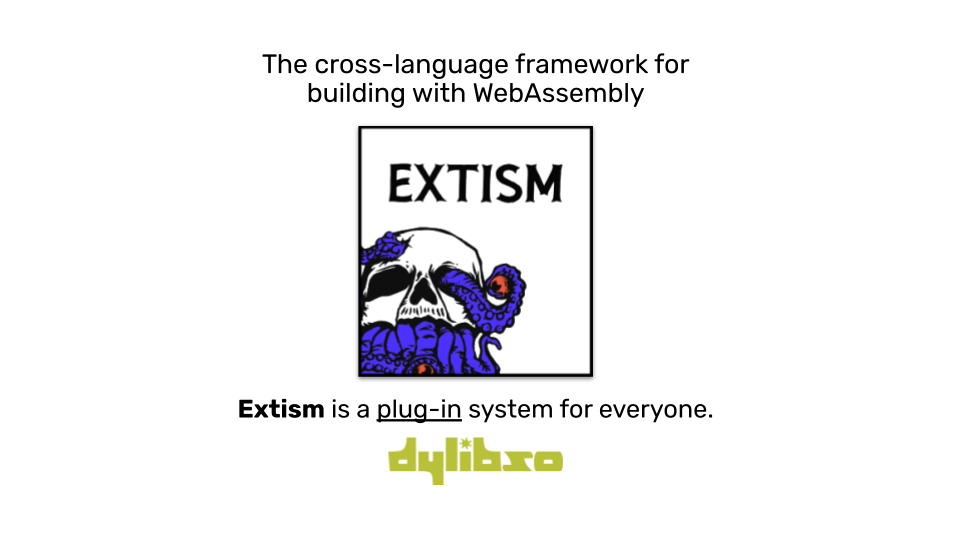

---
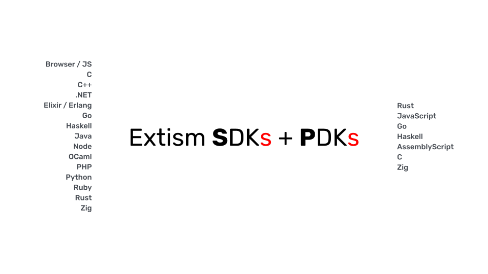

---
# Extism SDKs

https://extism.org/docs/concepts/host-sdk

---
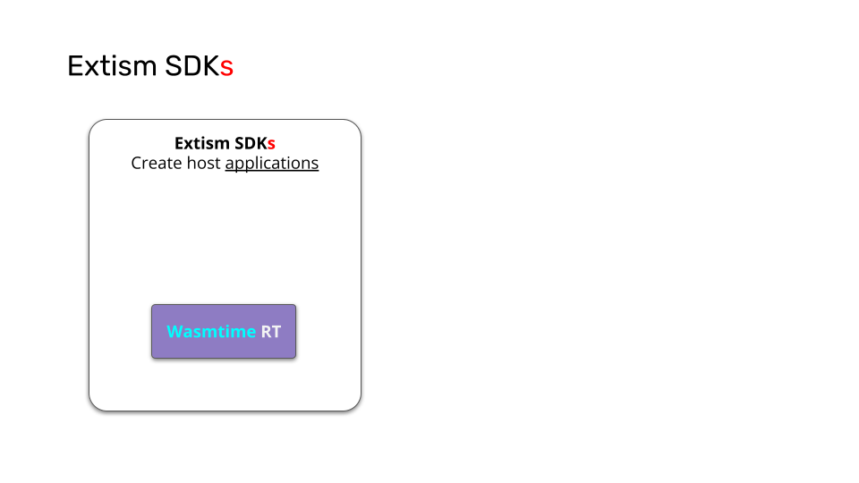

---
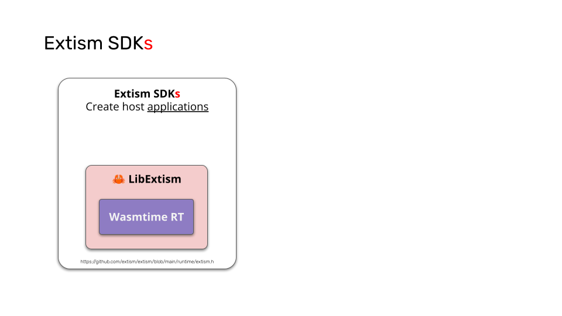

---
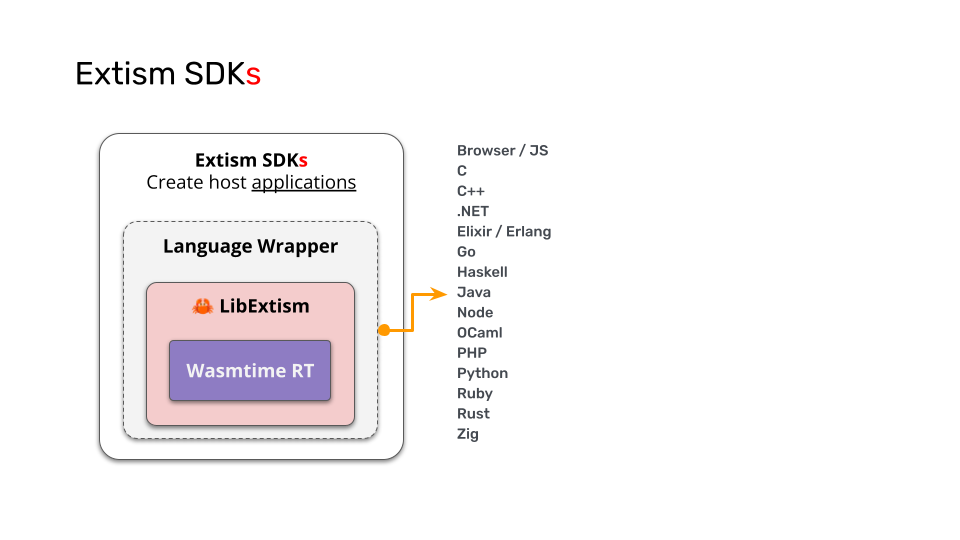

---
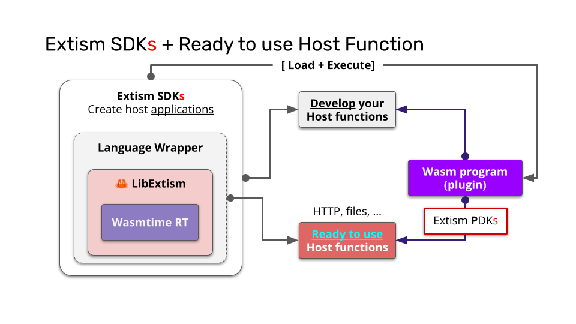

---
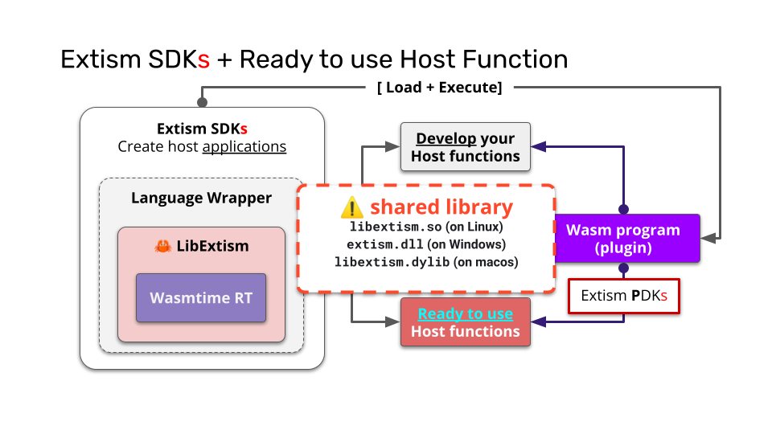

---
# Go-SDK: 
## Extism 💖 Wazero
https://github.com/extism/go-sdk

---
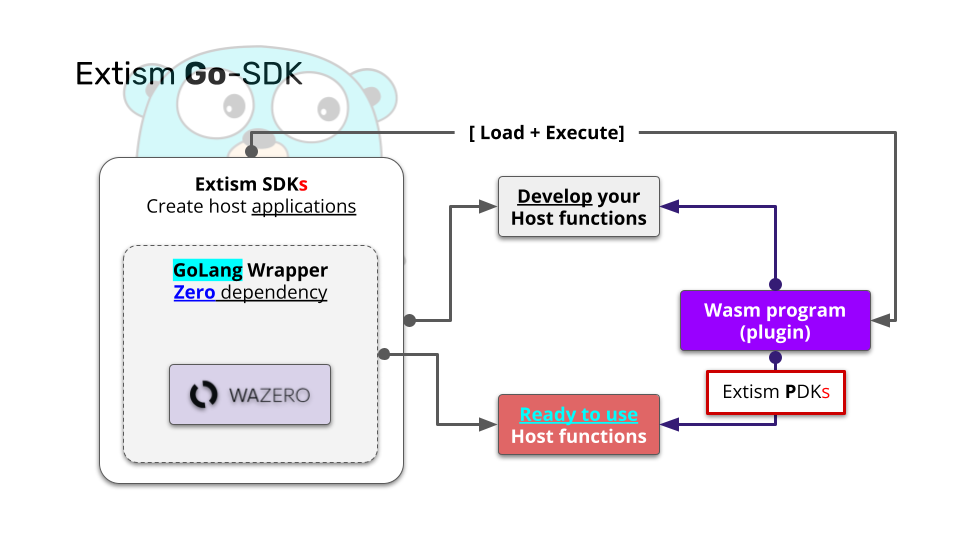

---
# How it works?

---
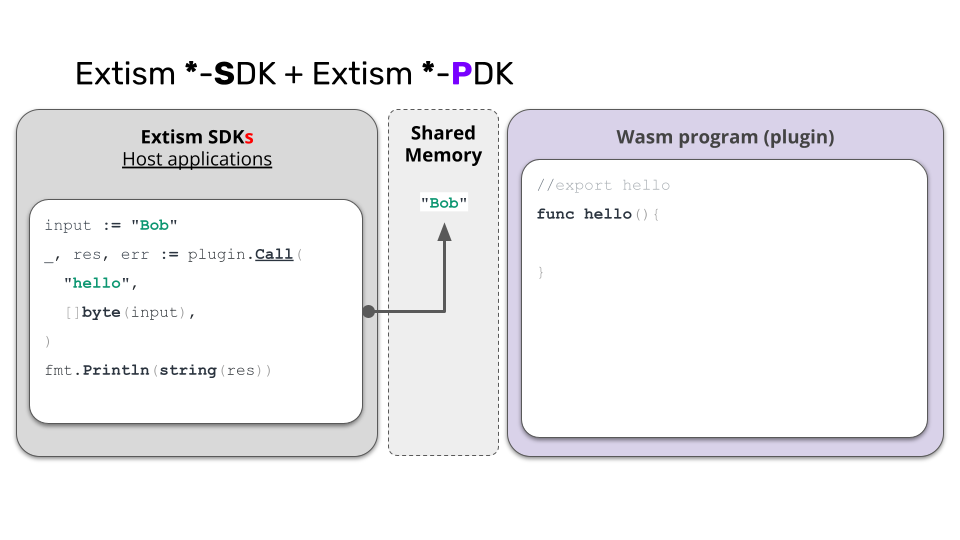

---
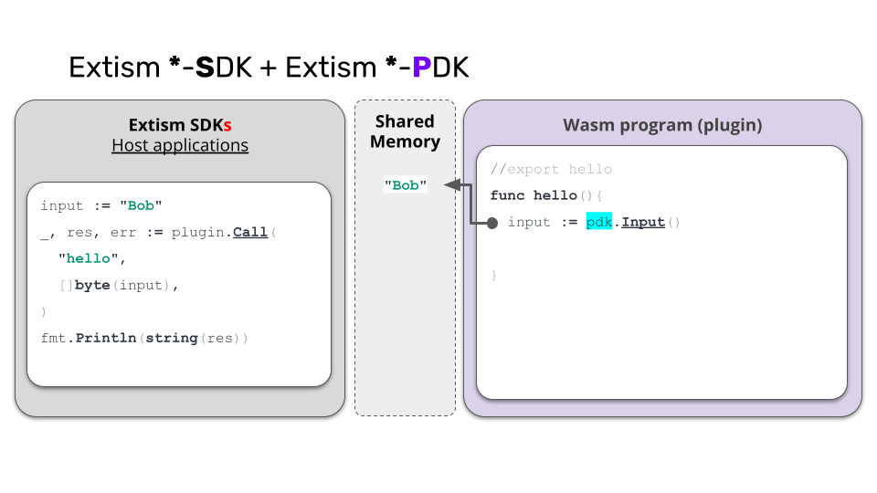

---
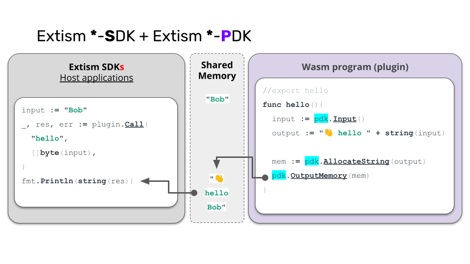

---
# Demo time! 🚀
> Let’s write some Extism Wasm plugins (with the PDKs)

- 03-go-plugin + **Extism CLI**
- 04-rust-plugin + **Extism CLI**

---
# Create a Host Application
## Write a CLI with the Extism Go-SDK

---
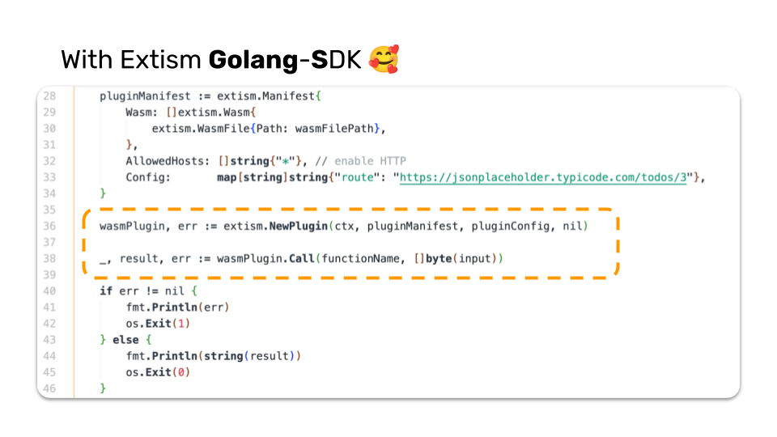

---
# Demo time! 🚀
> Let’s write a Host Application (with the Go SDK)

- 05-go-host-application
- 06-http-server

---
# Btw

## You can add Host functions to Extism

---
# Next

## Extism 💜 Java ☕️

