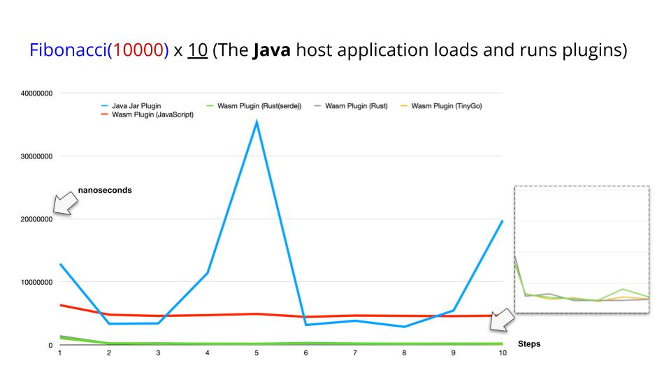
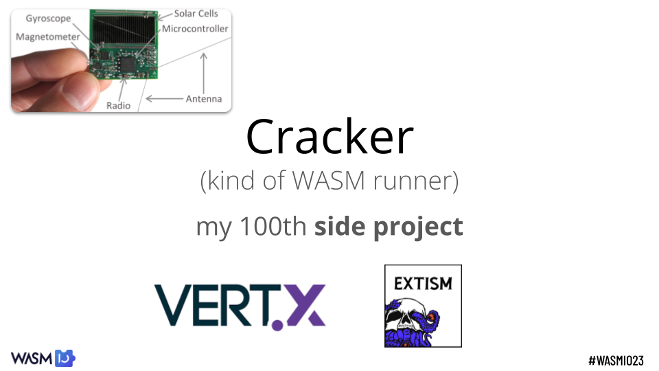
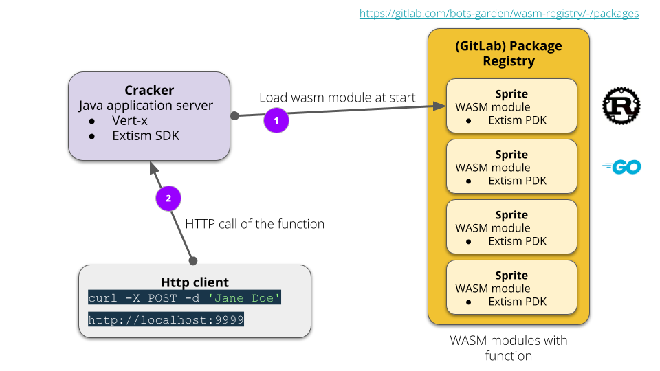

# WASI Part 3: Extism 💜 Java ☕️

## WebAssembly (Wasm), outside the browser with Wasi

---
# Wasm Plugins for Java… 

## Is it worth it?

---
# Spoiler: yes ⇒ quick benchmark
> WASMIO 2023

**CLI Java host application**:
- Load a plug-in with a function
- Execute the function

**Plug-ins (with Java, Extism)**:
- Java (jar file)
- TinyGo
- Rust (with and without Serde)
- JavaScript inside WASM

> https://github.com/bots-garden/wasm-io-2023/tree/main/01-extism-plugin

---

---

---

---
# Demo time! 🚀

